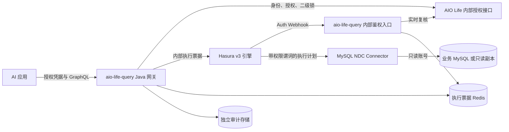

# AIO Life Query 智能数据查询服务需求方案

版本：v0.4 直接 Token 校验与 MCP；日期：2026-10-05；状态：`time_record` 单表实现及本地验证，未生产部署。

已确认：Java、独立部署、AI 结构发现与查询、权限隔离、引入 Hasura、直接调用 AIO Life 校验 Token / API Key、MCP 接入。本文其余范围与额度为设计建议。

首期实现位于本地独立仓库 `aio-life-query/`，配套授权代码位于 `aio-life-server` 的 `sso.query`。运行方式、真实限制和验收记录以 `aio-life-query/README.md` 为准。以下章节保留完整目标设计；首期已实现 REST、MCP、直接凭据校验和单表明细/统计；尚未实现逐应用长期授权、授权管理 UI、取消接口及多表关系。当前固定为 `aio-life-query` / `time.read`，通过功能开关、现有凭据与二级锁放行；以下涉及用户授予独立应用 scopes 的内容属于后续目标，不是当前已经存在的权限事实。网关采用更小的 GraphQL 子集：单根字段，拒绝片段与指令，统计也限制 93 天；审计使用独立持久卷，无业务库新增表。

**结论：采用 `aio-life-query` Java 网关 + Hasura 查询引擎 + MySQL Connector。AI 读取授权后的业务模型并提交 GraphQL；用户身份、应用授权、二级锁由 AIO Life 判定，行列权限由 Hasura 在查询计划中落实。**

本版替代 v0.1 的自由 SQL 入口、Java SQL 改写器和业务库 Mapper 执行器；不同时维护两条通用查询通道。MySQL 仍执行 Connector 生成的 SQL，AI 不需要编写 SQL。复杂业务操作继续由原业务 API 承担。

## 1 服务名与职责

| 项目 | 设计 |
| --- | --- |
| 产品 / 工程 / 部署服务名 | AIO Life Query / `aio-life-query` / `aio-life-query` |
| Java 根包 / 环境变量前缀 | `top.aiolife.query` / `AIO_QUERY_` |
| Java 运行时 | Java 21 + Spring Boot，独立管理依赖 |
| 对外入口 | REST 工具接口；MCP 适配器复用同一应用服务 |
| 独立进程 | `aio-life-query`、`aio-life-query-hasura`、`aio-life-query-mysql-connector` |
| 用户体系 | 复用 AIO Life 身份和业务锁，不复制用户密码或认证库 |
| 模型调用 | 由外部 AI 应用负责；本服务不保存大模型 API Key |

Java 负责业务接入和控制层；Hasura 是独立基础组件，其引擎实现语言不要求是 Java。`aio-life-query` 不用 JDBC 直查 AIO Life 业务库；自身审计等持久化遵循 MyBatis / Mapper 规范。

## 2 Hasura 版本选择与落地前提

**设计目标为 Hasura v3 引擎 + MySQL NDC Connector 本地部署，具体版本组合在 M0 验证后固定。不能把 v2 的配置文件直接用于 v3，也不能根据开源标签推断所有组件免费可用。**

| 已核实事项 | 本项目决定 |
| --- | --- |
| v2 官方将 MySQL 自托管列为 Self-Hosted Enterprise | 不把 v2 社区镜像当作免费 MySQL 方案；若转用 v2，重新确认商业许可和配置方案 |
| v3 引擎读取 OpenDD 元数据，通过 NDC Connector 执行查询；仓库提供本地运行方式 | 分别部署引擎和 Connector，元数据进入 Git 和构建流水线 |
| v3 引擎仓库声明 Apache-2.0，官方 MySQL Connector 页面也标注 Apache 2.0 | 仅说明这些源码的许可声明，不等于 DDN 托管平台或全部依赖均免费 |
| 当前 MySQL Connector 源码构建引用 `org.jooq.pro:jooq:3.19.8`，读取 `JOOQ_PRO_EMAIL` / `JOOQ_PRO_LICENSE` | 核验目标镜像及其依赖使用条件、能否合法且可重复构建；本次不假定无需商业依赖 |
| 官方 MySQL Connector 支持查询、筛选、简单聚合、排序、分页、关系和视图 | 先验证这些能力；不承诺任意 SQL 等价能力、任意分组、窗口函数或实时订阅 |

依据：[v2 MySQL 部署范围](https://hasura.io/docs/2.0/databases/mysql/index/)、[v3 引擎运行方式](https://github.com/hasura/graphql-engine/blob/master/v3/README.md)、[v3 Cargo 清单](https://github.com/hasura/graphql-engine/blob/master/v3/Cargo.toml)、[MySQL Connector 能力](https://hasura.io/connectors/mysql)、[Connector 当前构建依赖](https://github.com/hasura/ndc-jvm-mono/blob/main/ndc-connector-mysql/build.gradle.kts)。核验日期为本文日期。

**M0 阻断条件：** 在测试环境完成引擎、Connector、MySQL 的版本兼容和许可核验；证明元数据可以在本地构建、运行时不依赖云控制面，且无需把业务数据或凭据上传到外部平台。若无法满足，记录具体缺口，再选择适用的商业部署或 Connector 调整方案，不能以“已接入 Hasura”掩盖未解决依赖。

## 3 用户、目标与首期范围

| 使用者 | 典型需求 | 成功标准 |
| --- | --- | --- |
| 普通用户 | AI 分析自己的时迹、目标、待办、阅读 | 结果口径正确，不能读取其他用户数据 |
| AI 应用 | 获取模型、字段、筛选方式和关系，执行查询 | 不需要数据库凭据，也不需要传入用户 ID |
| 数据管理员 | 发布数据模型、字段和权限模板 | 新对象默认不可见，变更有版本且可回滚 |
| 运维人员 | 定位慢查询、拒绝原因和依赖故障 | 有审计和关闭开关，日志默认无业务正文 |

首期先以时迹完成闭环，再接入目标、待办、阅读。财务、消息、文件、私密笔记、系统用户、认证与模型密钥相关表默认不开放。管理员通过 AI 查询时同样只读取自己的数据，不继承数据库管理员权限。

首期支持单业务域内的筛选、排序、有限分页、经验证的简单聚合和注册关系；跨业务域问题由 AI 分别调用后分析。跨域查询结果没有共同事务快照，返回各次查询时间与数据新鲜度。写入、导出大文件、跨数据源关联不在首期。

## 4 架构与可信边界



| 组件 | 必须负责 | 不承担 |
| --- | --- | --- |
| AIO Life | 原凭据状态、账号状态、应用授权记录、二级锁和业务口径 | 通用 GraphQL 执行 |
| `aio-life-query` | 授权目录、GraphQL AST 校验、锁依赖解析、额度、执行票据、审计、结果复核 | 自行改写任意 SQL |
| Hasura | 角色对应的模型与字段权限、行过滤、GraphQL 计划 | 理解 AIO Life 二级锁、替用户审批授权 |
| Connector | 把授权后的计划转为数据库查询、连接池和执行资源控制 | 决定调用者拥有哪个用户身份 |
| MySQL | 只读对象授权、执行查询、数据库资源限制 | 自动继承 Java 业务接口的 `user_id` 条件 |

外部只开放 `aio-life-query`。Hasura 仅接受网关服务身份的连接，Webhook 仅接受 Hasura 服务身份，Connector 仅接受 Hasura，业务库仅向 Connector 的只读账号开放。使用网络策略和服务间认证；不能只靠端口不公开或一个可伪造的来源 Header。

运行通道不配置管理员身份旁路、NoAuth 或匿名读取；不把控制台、元数据管理端点、Connector 查询接口暴露给 AI。部署用的管理凭据与查询运行凭据分离。禁用备用认证模式，忽略外部所有 `X-Hasura-*` 身份/认证模式 Header，内部只构造允许的 Header。

**隔离强度说明：** 同一 MySQL 只读账号仍可能读取多个用户的行；行隔离依赖受信任的 Hasura 权限配置及完整入口链路。只读账号负责阻断写入，不提供数据库原生的逐用户行隔离。若要求引擎失陷后也无法跨用户读取，需要另行设计物理库、账号或数据库级隔离。

## 5 权限模型：谁、以哪个应用、能读什么

最终权限取以下交集，任一条件失败即拒绝：

```text
有效用户身份 ∩ 有效调用应用 ∩ 用户对该应用的授权
∩ 已发布数据集及字段 ∩ 当前业务锁状态
∩ Hasura 角色行列规则 ∩ 数据库只读对象权限 ∩ 查询额度
```

### 5.1 角色与应用授权

角色表示固定能力模板，不按用户创建角色。用户归属通过可信的 `x-hasura-user-id` 传递。首期建议：

| 内部角色 | 授权域 | 数据范围 |
| --- | --- | --- |
| `ai_time_reader` | `time.read` | 当前用户的已开放时迹模型 |
| `ai_goal_reader` | `goal.read` | 当前用户的已开放目标模型 |
| `ai_task_reader` | `task.read` | 当前用户的已开放待办模型 |
| `ai_reading_reader` | `reading.read` | 当前用户的已开放阅读模型 |

一个请求只使用一个业务域角色。网关从实际 GraphQL 根字段、关系、筛选和排序解析涉及的域；客户端传入的 `domain` 只是声明，必须与解析结果一致。首期拒绝混域查询，不建立所有业务组合的角色。

AIO Life 新增应用授权记录，建议字段：`grantId`、`userId`、`appId`、`allowedScopes`、`permissionProfile`、`status`、`expiresAt`、`grantVersion`。其中 `userId` 来自登录身份，应用身份来自已注册客户端或服务凭据，客户端不能用请求体自行选择。

首期同一能力模板使用统一字段白名单；需要仅统计或隐藏更多字段时，新增少量经过审核的模板，不能只改返回 JSON。模板必须同时约束输出字段、筛选字段、排序字段、聚合字段及关系。授权记录归 AIO Life 管理，`aio-life-query` 不保存另一份可独立放行的授权事实。

用户在已登录的业务界面授权指定应用的业务域，可撤销、设置有效期。已有 API Key 不自动获得全部查询域，也不能绕过二级锁；必须绑定明确的应用授权。

### 5.2 身份凭据与执行票据

当前实现直接使用现有 AIO Life 登录 Token 或 API Key。可信客户端把凭据放在 `Authorization: Bearer ...`，REST 与 MCP 共用此方式；工具参数中没有 token、userId 或 role。网关每次调用 `POST /api/internal/query/access/check-token`，同时携带独立 `X-AIO-Query-Service-Key`；请求体仅允许数据集 `time_record`。此路由不加入登录拦截器排除列表，原有 Sa-Token / API Key 拦截器完成身份、到期、撤销及账号状态检查，再由查询授权服务检查三个二级锁，并返回字符串 userId、固定角色/范围、凭据摘要 ID、类型及到期时间。

网关不本地解析 JWT、不共享 AIO Life Redis、不缓存鉴权结果。服务密钥不能代替用户凭据；超时或认证依赖故障必须拒绝。一次执行在入口、Hasura Webhook 和结果交付前复核；MCP 的 initialize 和 tools/list 也需要实时身份校验，不使用持久会话保存用户身份。

原 5 分钟 `aqt_` 签发/撤销接口保留，当前网关默认不使用它。后续如需第三方应用授权、按域 scopes 和独立生命周期，再加入授权记录或专用凭据；首期不实现通用 OAuth 服务。API Key 本身仍是原服务的通用凭据，本查询入口只提供时迹只读能力，不能宣称 API Key 已被改造成仅时迹凭据。

`aio-life-query` 验证后为单次执行生成内部随机票据，存储于专用 Redis，建议有效期 30 秒，且不超过上游凭据剩余有效期。记录内容：

| 字段 | 用途 |
| --- | --- |
| `ticketHash`、`queryId`、`audience` | 只存票据摘要，绑定 Hasura 执行及查询 |
| `subjectRef`、`appId`、`credentialId`、`credentialType` | 当前绑定真实主体、固定应用与来源凭据；后续应用授权增加 grant 引用 |
| `role`、`datasets`、`requiredLocks` | 服务端从当前操作推导的能力与锁依赖 |
| `operationHash`、`variablesDigest` | 绑定网关已校验的实际操作和变量；使用受保护摘要，避免明文敏感参数 |
| `releaseId`、`grantVersion`、`expiresAt`、`state` | 避免旧策略继续执行，限制过期和重放 |

票据不返回给 AI，不写日志，不作为客户端可重用的查询凭据。一次向 Hasura 的执行只允许一次票据消费；自动重试必须重新授权并签发新票据，不能复用已经消费的票据。

网关发出的操作与票据内容一致由网关保证。**Webhook 接收 Header 并不意味着它能看到或核验完整 GraphQL 请求体**；操作绑定和字段检查在网关完成，这也是禁止绕过网关直接访问 Hasura 的原因。

### 5.3 一次查询的完整顺序

1. AI 调用目录接口；网关验证凭据并向 AIO Life 获取当前授权，返回可见数据模型及业务语义。
2. AI 提交 GraphQL 操作、变量和目录版本。网关限制请求体并解析 AST，验证唯一操作、字段、关系、参数类型、域、深度和成本。
3. 网关根据实际引用的数据集计算全部锁依赖，调用 AIO Life 实时访问决策；不能让 AI 自报用户 ID、角色或已解锁状态。
4. 网关写入开始审计，签发内部执行票据，以 `Authorization: Bearer <ticket>` 调用内网 Hasura。
5. Hasura 调用网关内部 Auth Webhook；Webhook 验证服务身份、消费票据，并向 AIO Life 再次复核账号、凭据、应用授权和该操作的所有业务锁。
6. Webhook 仅在允许时返回服务器生成的角色与用户会话变量；Hasura 应用行列策略并交给 Connector 执行。
7. 网关有界读取结果；若 GraphQL 返回 `errors`，整次请求失败，不交付部分 `data`。过滤基础设施错误细节。
8. 网关在交付前再次复核授权、业务锁和发布版本，完成终态审计后返回结果。校验失败则丢弃结果。

Webhook 响应示例，ID 为虚构值：

```json
{
  "x-hasura-role": "ai_time_reader",
  "x-hasura-user-id": "1001"
}
```

拒绝时返回认证失败，不返回 `admin` 或匿名角色兜底。Auth Webhook 配置为只转发内部 `authorization`，不透传外部所有 Header；生产只启用这一认证模式。[Hasura v3 Webhook 配置与响应](https://hasura.io/docs/3.0/auth/webhook/webhook-mode/)

API Key 撤销、用户禁用、授权收窄或业务重新上锁后，新的授权检查必须拒绝。关闭允许结果缓存和认证成功缓存；授权依赖故障时拒绝放行。首期为有界同步响应，不在最终检查前流式输出结果。返回前复核只能覆盖最后一次决策时刻，已交付的数据和网络中已发送的字节无法撤回，不能承诺分布式零时间窗撤销。

### 5.4 二级锁如何保持现有语义

AIO Life 内部访问决策接口复用 `SecondaryLockGuard.checkMenus(userId, ...)` 和现有锁状态，不能在 `aio-life-query` 中复制 Redis Key 规则。对新 AI 查询入口同时执行 `/mcp/tools` 总锁；REST 与 MCP 使用相同规则。

| 数据集引用 | 附加业务锁依赖 |
| --- | --- |
| 时迹记录或时迹统计 | `/time/time-tracker`、`/time/dashboard` |
| 时迹分类及有效分类关系 | `/time/my-categories` |
| 目标 | `/task/goal` |
| 待办 | `/task/todo` |
| 阅读 | `/record/read` |

检查的是这些菜单中实际配置了锁的项及其当前解锁状态，不要求未加锁菜单先“解锁”。未知数据集或未知锁映射默认拒绝。

查询时迹并展开分类，会同时检查时迹和分类锁；即使分类只出现在 `where` 或 `orderBy` 中，也计算分类依赖。目录按当前锁过滤模型、关系和输入能力。发现、描述、预检、执行都检查权限；预检成功不产生后续放行特权。

这部分是动态业务授权，由网关及 Webhook 落实；Hasura 静态角色并不会自动理解锁状态。同域角色拥有的模型也不能绕过网关的逐数据集锁检查。

## 6 Hasura 行列权限的具体配置

### 6.1 普通个人表

以时迹为例，逻辑模型 `TimeRecords` 映射 `time_record`，`userId` 映射 `user_id`，`isDeleted` 映射 `is_deleted`，`durationMinutes` 映射现有 `duration`。权限意图为：

```text
实际可读行 = 当前用户的行 AND is_deleted = 0 AND 调用者业务筛选
```

即使 AI 的筛选使用 OR、别名或嵌套关系，也不能替换系统行条件。统计必须在授权行集合上进行，不能先统计全表再过滤结果。

以下为 v3 OpenDD 权限设计片段，不是完整可部署配置。实施时还需提供 `ObjectType`、`Model`、数据源字段映射、标量、比较操作符、关系及 GraphQL 配置，并按选定版本构建验证。

```yaml
kind: ModelPermissions
version: v1
definition:
  modelName: TimeRecords
  permissions:
    - role: ai_time_reader
      select:
        filter:
          and:
            - fieldComparison:
                field: userId
                operator: _eq
                value:
                  sessionVariable: x-hasura-user-id
            - fieldComparison:
                field: isDeleted
                operator: _eq
                value:
                  literal: 0
---
kind: TypePermissions
version: v1
definition:
  typeName: TimeRecord
  permissions:
    - role: ai_time_reader
      output:
        allowedFields:
          - id
          - date
          - categoryId
          - durationMinutes
```

这是最小字段模板，标题、描述等自由文本默认不包含；需要开放时逐项加入审核清单。`userId` 和 `isDeleted` 留在内部模型中供权限使用，但不向 AI 暴露。

Hasura v3 的模型过滤可引用身份会话变量，类型权限通过 `allowedFields` 控制输出字段。[模型权限](https://hasura.io/docs/3.0/auth/permissions/model-permissions/)、[字段权限](https://hasura.io/docs/3.0/auth/permissions/type-permissions/)

用户 ID 在外部接口统一为字符串；内部会话变量须与 Connector 的 BIGINT 标量映射兼容。M0 必须验证大于 JavaScript 安全整数范围的 ID 全链路不丢精度，不能用浮点数中转。

### 6.2 字段控制覆盖所有使用位置

`TypePermissions.output` 只表达输出授权，不能把它当作所有输入位置的保障。每个对外模型另行定义筛选表达式、排序表达式、聚合能力和关系白名单，并由网关基于类型化 AST 校验。

例如未开放 `description` 时，以下操作均拒绝：返回该字段、按其内容筛选、排序、对其计数/聚合、通过关系条件间接判断内容。新列不会因 Connector 重新采集而自动进入 GraphQL 模型。

首期尽量使每个公开模型只对应一个明确字段模板；需要不同字段级别时发布不同的模型/输入能力或明确的角色策略。不能让全局宽松输入类型突破某个角色的字段模板。

### 6.3 无归属列的子表与关系

`thought_rela_event` 这类没有 `user_id` 的子表，不能用“只读”替代归属判断。未来接入时必须通过父记录证明当前用户归属，并检查子记录、父记录的逻辑删除；关联到其他受保护对象时，还需校验该对象归属。

若使用 Hasura 关系权限，首期仅允许同一 Connector 内经过验证的关系；v3 文档明确不同 Connector 间的远程关系不支持用于权限过滤。因此本版不设计跨 Connector 的父级授权。[关系权限限制](https://hasura.io/docs/3.0/auth/permissions/model-permissions/)

任何可从根查询直接访问的子模型也必须有自己的授权规则，不能只在父模型上配置过滤。数据完整性有问题、关系指向其他用户时，关联结果必须为空或拒绝，不能泄露对方字段。

### 6.4 复杂业务口径与聚合

| 情况 | 接入方式 |
| --- | --- |
| `time_record` 普通明细 | 直接模型，使用现有 `duration` 分钟值 |
| 公共时迹分类、用户覆盖、隐藏与启用状态 | 建立与现有业务一致的有效分类模型；验证前只提供安全分类 ID，不假装原表联查等价 |
| 按月、按分类统计 | 优先使用已验证的 Connector 聚合；不支持任意分组时发布固定维度汇总视图/模型 |
| 消息发送方或接收方、未读筛选 | 保留现有 API；其可见规则并非固定 `user_id = 当前用户` |
| 文件元数据及下载 | 保留业务接口的文件归属与访问检查，不直接开放文件表 |

汇总视图必须按 `user_id` 及业务维度分组并排除删除记录，保留 `user_id` 给 Hasura 权限过滤，禁止先把不同用户汇总到同一行。若是静态全局视图，可先计算各用户各自的分组，再按用户过滤；若是依赖用户输入的 Native Query，必须另行证明用户条件在正确位置生效，不能交给 AI 定义 SQL。

首期不开放任意 Native Query、Command、自定义函数和远程服务执行。复杂口径确需新增 SQL 时，由开发者维护版本化数据库视图/迁移并审核，Hasura 只发布其受控模型；Java 业务接口中的 SQL 仍遵循 Mapper 规范。

## 7 AI 结构发现与查询接口

### 7.1 AI 看到什么

“读取表结构”落为读取授权后的业务模型：模型名、描述、字段类型、单位、状态枚举、日期与时区、允许筛选/排序/聚合、关系基数、查询样例，以及 `schemaVersion`、`policyVersion`、`releaseId`。

内部 Connector 可以采集指定库结构，但采集不等于公开。发布者选择对象、补充业务语义、配置权限并构建后才可查询。AI 不获取全库 DDL、连接串、未授权对象数量、认证字段或真实样本行。

Hasura 角色 Schema 反映静态角色权限；网关还要按当前应用授权和锁状态裁剪目录及可用关系。统一由目录接口发现，执行入口不开放任意 `__schema`、`__type` 查询。不要用管理员 Introspection 结果直接给 AI。

### 7.2 对外 REST 与 MCP

| REST 接口 | MCP 工具 | 语义 |
| --- | --- | --- |
| `GET /api/v1/datasets` | `aio_query_list_datasets` | 当前凭据可见的模型目录 |
| `GET /api/v1/datasets/{name}` | `aio_query_describe_dataset` | 单模型结构、输入能力、口径及样例 |
| `POST /api/v1/queries/validate` | `aio_query_validate` | 解析和授权预检，不查询业务数据 |
| `POST /api/v1/queries/execute` | `aio_query_execute` | 重新校验并执行单次同步查询 |
| `POST /api/v1/queries/{id}/cancel` | `cancel_query` | 取消同用户、同应用的在途查询；底层终止能力验证后启用 |

首期仅一个固定逻辑数据源，客户端不能提供数据库 URL、Connector 地址、Header 转发配置或可执行权限片段。内部授权与 Webhook 不在公网接口路由中。

请求示例为拟定模型契约，`Date`、根字段和参数名最终以发布的 GraphQL SDL 为准，客户端从目录获取准确样例：

```json
{
  "domain": "time",
  "schemaVersion": "schema-1",
  "policyVersion": "policy-1",
  "operationName": "RecentTimeRecords",
  "query": "query RecentTimeRecords($start: Date!, $end: Date!) { timeRecords(where: {date: {_gte: $start, _lt: $end}}, limit: 100) { id date categoryId durationMinutes } }",
  "variables": {
    "start": "2026-09-01",
    "end": "2026-10-01"
  }
}
```

请求没有 `userId` 或 Hasura 角色。字段标识符来自发布 Schema，参数值使用 GraphQL variables；网关检查展开后的值与输入类型，不能仅检查文档表面的字面量。

响应保留 GraphQL 对象结构，包装为项目标准响应；数据为虚构示例：

```json
{
  "rscode": "0",
  "result": null,
  "data": {
    "queryId": "8d41e4b7-4d75-4cc1-81aa-7c35c9c6e150",
    "result": {
      "timeRecords": [
        {"id": "r-example", "date": "2026-09-01", "categoryId": "1008", "durationMinutes": 60}
      ]
    },
    "rowCount": 1,
    "schemaVersion": "schema-1",
    "policyVersion": "policy-1",
    "releaseId": "release-1",
    "executedAt": "2026-10-05T10:00:00+08:00",
    "dataFreshness": {"mode": "primary", "replicaLagMs": null},
    "traceId": "trace-example"
  }
}
```

ID、BIGINT、DECIMAL 对外返回字符串，普通有界整数可保持数值；数据库 NULL 保留为 JSON `null`。序列化转换依据发布 Schema 和查询别名路径，不能只按 JSON 字段名猜测类型；Connector 已丢失的精度无法由 Java 补救，必须在接入验收中阻止。

`rowCount` 表示本次返回记录数量，不是符合筛选条件的总量。查询显式 `limit` 表示用户选择的结果集，不代表已获得全量数据；需要完整统计时调用聚合模型，不把一页明细当作总体。首期超出网关行数/字节上限整次报错，不任意裁剪嵌套结果后当作完整数据返回。

错误码建议：`AUTH_REQUIRED`、`ACCESS_DENIED`、`DATASET_UNAVAILABLE`、`SECONDARY_LOCK_REQUIRED`、`QUERY_UNSUPPORTED`、`QUERY_LIMIT_EXCEEDED`、`QUERY_TIMEOUT`、`QUERY_CANCELLED`、`SCHEMA_CHANGED`、`AUTH_SERVICE_UNAVAILABLE`、`UPSTREAM_QUERY_FAILED`。GraphQL 的 HTTP 200 不代表成功，必须检查 `errors`；未知对象与无权对象使用一致的不可用语义。

MCP 会话 ID 不作为认证凭据；每次工具调用使用当前凭据并进入同一校验链。结果正文、数据库注释可能含有指令性文字，均作为业务数据处理，不影响权限或执行策略。

### 7.3 内部接口契约

当前新增接口如下；未来的多域/逐应用授权返回契约另行扩展：

| 所属服务 / 接口 | 输入与职责 |
| --- | --- |
| AIO Life `POST /api/internal/query/access/check-token` | 原 Bearer + 服务密钥；现有认证链验证身份、账号及凭据，查询服务检查二级锁并返回固定 time.read 决策 |
| AIO Life `POST /api/query/access-token` | 保留的旧短期凭据签发入口，只接受登录会话；当前网关不使用 |
| AIO Life `POST /api/internal/query/access/evaluate` | 保留的旧凭据校验入口；当前网关默认使用 check-token |
| `aio-life-query` `POST /internal/hasura/auth` | 仅 Hasura 服务身份调用；消费执行票据并复核，按 Hasura 契约直接返回会话变量 |

`evaluate` 不能仅凭一个外部传入的 `userId` 返回该用户身份；内部上下文引用也必须绑定签发服务、来源凭据和有效期。服务间调用设置独立并发池和短超时，Webhook 不回调外部查询接口，避免递归或请求线程池耗尽。

## 8 查询限制、超时与审计

### 8.1 GraphQL 校验与资源上限

网关采用完整 GraphQL 解析和 Schema 验证，解析变量、片段、别名、指令及嵌套输入，不能用字符串或正则判断业务范围。只接受一个具名 `query` 操作，拒绝 mutation、subscription、批量请求、多操作文档和未注册执行扩展；查询文档引用的所有分支都必须满足授权。

以下为初始建议，上线前用真实规模压测调整：

| 项目 | 初始约束 |
| --- | --- |
| 查询文档 / 整体请求 | 32 KiB / 64 KiB |
| AST 节点 / 展开后字段数 | 1,000 / 200，片段递归和循环先拒绝 |
| 嵌套深度 / 根字段数 | 最多 4 层 / 最多 5 个，同一业务域 |
| 列表大小 | 默认每列表 100；每列表最大 1,000；估算嵌套乘积和实际总返回条数另限 1,000 |
| 总响应 | 1 MiB，解压后计量；有界缓冲，超限整次失败 |
| 日期范围 | 时迹明细建议最多 93 天；更长区间使用已批准聚合模型 |
| 大偏移 | 限制 offset；稳定排序包含唯一 ID，按模型发布分页能力 |
| 单用户并发 / 单数据源并发 | 2 / 10；用户额度跨应用累加 |
| 单用户频率 | 30 次/分钟，目录、预检、执行均计入 |
| 执行时间 | 默认 5 秒，最大 10 秒；另设整个请求截止时间 |

限制在变量替换和片段展开后生效，别名、嵌套列表、聚合和关系也计成本。SQL 的 LIMIT 或 GraphQL 的 limit 都不能保证扫描开销小；聚合返回一行也可能扫描大量数据，必须要求可控日期范围、索引和数据库侧执行上限。

### 8.2 查询终止的真实边界

网关 HTTP 超时只代表停止等待，不证明数据库语句终止。M0 必须验证所选 Connector 的连接池、语句超时、取消传播和连接复用行为；结合目标 MySQL 支持的执行时限设置，证明失联或超时后资源在确定时限内释放。

如果 Connector 不支持即时取消，可以实现“请求取消后不再交付结果，数据库在已验证硬超时内终止”，并在取消响应区分 `cancelRequested` 与 `executionTerminated`。若数据库端无法保证有界终止，不能上线通用查询。需要修改 Connector 时，修改项单独纳入开发范围及版本维护，不假定 Hasura 开箱即有全部能力。

启用取消 API 时，客户端可提供 UUID 查询请求 ID，并在入队时绑定主体和应用，重复 ID 不自动重试；取消只能操作已绑定的本次查询，不能接收数据库连接 ID。HTTP 断开也进入取消流程，审计保留最终终止状态。

### 8.3 审计与观测

记录 `queryId`、主体、应用、授权记录、数据集、角色模板、发布版本、脱敏查询指纹、耗时、返回行数/字节数、拒绝原因、终止状态和 traceId。默认不记原始凭据、内部票据、变量值、查询结果和包含业务字面量的原始文档。

此要求同时覆盖网关、Hasura、Connector 的访问日志、SQL 日志和追踪，不仅覆盖 Java 日志；Trace 不携带身份票据或业务正文。审计摘要保留期建议 30 天。

开始审计无法持久化时不执行；终态审计无法持久化时不交付成功。可用有界持久队列提高短时故障可用性。提供全服务、数据域、数据集关闭开关；触发后拒绝新请求并丢弃相关在途结果。监控拒绝率、超时、数据库未终止查询、授权接口耗时和审计积压。

## 9 部署、配置发布与 Java 模块

### 9.1 独立部署单元

| 部署单元 | 持有的配置 / 凭据 | 网络边界 |
| --- | --- | --- |
| `aio-life-query` | AIO Life 内部调用身份、Redis 和自身审计库访问 | 唯一对外业务入口；管理端点另设内网端口 |
| `aio-life-query-hasura` | 已构建 OpenDD、AuthConfig、Connector 地址 | 仅网关可访问查询端口 |
| `aio-life-query-mysql-connector` | 被批准对象的元数据、业务 MySQL 只读凭据 | 仅 Hasura 可访问 |
| 票据 Redis | 有 TTL 的票据摘要与状态 | 仅网关及其 Webhook 模块 |
| 审计存储 | 审计摘要 | 与业务只读凭据分开 |
| AIO Life | 用户、应用授权、原凭据、二级锁事实 | 内部访问决策接口仅向受信服务开放 |

可先通过 Docker Compose 管理各独立容器，不要求首期引入 Kubernetes。生产固定引擎、Connector、构建 CLI 的版本/commit 和镜像摘要，不使用漂移的 `latest`。健康检查包含元数据加载及依赖状态；鉴权依赖故障时不能切换为匿名模式。

Connector 数据库账号仅对已批准表/视图授予 SELECT，不授予写入、DDL、FILE、过程执行或全库管理权限。结构采集若需更广权限，使用独立部署凭据，采集完成即收回，不把部署账号交给运行时。

优先连接只读副本，但需要确认实际是否具备副本；没有时先在测试库验证，再评估主库容量预算。副本故障不自动回退主库。结果标注数据源角色与新鲜度；无法测量复制延迟就返回未知，不能返回 0 假装实时。

### 9.2 一套发布清单约束网关和 Hasura

建议在新仓库维护以下目录，现阶段不创建仓库：

```text
aio-life-query/
├── app/                       # Spring Boot 网关
├── hasura/metadata/            # OpenDD 模型、关系、权限和输入能力
├── hasura/auth/                # AuthConfig 模板，无秘密
├── catalog/                   # 字段语义、单位、角色模板和锁依赖
├── db/views/                  # 审核后的业务视图迁移
├── deploy/                    # 容器编排和网络策略
└── tests/security/            # 双用户隔离和目标 MySQL 集成夹具
```

发布包绑定：Connector 结构指纹 + OpenDD 构建产物 + 角色 SDL + 目录能力 + 锁映射 + `schemaVersion` / `policyVersion` / `releaseId`。CI 检查目录字段与真实 Schema、角色、过滤、输入能力一致，缺少归属或锁映射时拒绝发布。

新增表/列默认不发布。权限字段缺失、重命名或类型变化时停用受影响模型；目标数据库结构以实际采集为准，仓库表结构文档只提供语义参考。

按完整发布单元切换：先构建并验证新 Hasura 实例，再让匹配版本的网关路由到它。一个请求始终绑定同一发布版本，禁止滚动更新期间网关和引擎使用不同权限。回滚也生成新发布记录，动态账号/凭据撤销状态不回滚。旧票据、旧预检和旧目录不得恢复被收回的权限。

首期不做查询结果缓存；静态目录可按发布版本缓存，但每次对外返回都重新依据当前授权及锁状态过滤。不要只按 GraphQL 文本缓存结果或按角色缓存当前用户可见目录。

### 9.3 Java 模块与实现分工

| 模块 | 实现内容 |
| --- | --- |
| `access` | 凭据校验客户端、实时访问决策、内部票据签发与消费 |
| `catalog` | 读取发布目录，按当前授权和锁过滤，返回正确 SDL 样例 |
| `query` | GraphQL AST / Schema 验证、模型与锁依赖解析、成本计算 |
| `hasura` | 内部 HTTP 客户端、Webhook、上游错误映射和发布版本绑定 |
| `result` | 有界结果读取、Schema 驱动精度转换、交付前复核 |
| `audit` | 访问审计、查询生命周期和取消状态 |
| `transport` | REST 及 MCP 适配，复用同一查询应用服务 |

不新增原始 SQL fallback；Hasura 不支持的表达式明确报错或由已注册业务 API 承担。Java 不重建 Hasura 的通用查询优化器，但必须保留它不知道的业务授权、输入能力和资源控制。

AIO Life 需要新增：应用授权持久化、查询专用凭据签发、内部实时访问决策接口、查询业务域到现有锁的映射；不能只改 Hasura 配置就宣称完整接入。

## 10 验收标准与实施顺序

### 10.1 发布必须通过的验收

使用两个虚构用户 A/B、公共模板、已删除数据、敏感字段、错误归属关系和超过安全整数范围的 ID；在选定版本的真实 MySQL、Hasura、Connector 上验证。

| 场景 | 必须结果 |
| --- | --- |
| A 查询含 A/B 数据的明细、count、sum | 仅 A 的可见行进入结果和统计 |
| AI 伪造用户 Header、role、admin、认证模式 | 身份不改变，请求被拒绝或伪造值被丢弃 |
| 忘记传用户条件、复杂 OR、别名、片段 | Hasura 行条件持续生效；网关没有漏掉引用对象 |
| 已删除主表或子表 | 不出现在结果、关系或聚合中 |
| 隐藏字段用于输出、筛选、排序、聚合、关系谓词 | 全部拒绝，没有存在性旁路 |
| 子模型直接根查询、关系指向其他用户 | 父级归属和关联对象权限生效，不泄露 |
| 分类锁关闭，但只在 where/orderBy 引用分类 | 查询拒绝，不能通过筛选旁路锁 |
| 仅授权时迹的应用查询阅读，或提交混域查询 | 拒绝，不能更换客户端 role 扩权 |
| 目录发现、预检后撤销授权、API Key 或重新上锁 | 后续执行拒绝；交付前已知撤销的结果丢弃 |
| AIO Life / Redis / 审计不可用 | 拒绝或失败，不切换为旧许可或管理员 |
| 新表/列出现、字段类型漂移、发布版本不一致 | 默认隐藏或阻断受影响模型 |
| 两个用户并发、线程/连接复用、目录缓存命中 | 不发生用户、结果或授权串用 |
| 大整数与 DECIMAL、别名与嵌套路径 | 全链路无精度损失，外部表示符合约定 |
| 深度、别名、嵌套列表、宽日期聚合攻击 | 在进入数据库前拒绝或受硬执行上限约束 |
| 超时、断开、取消、引擎失联 | 不交付后续结果，数据库在已验证时限内终止 |
| GraphQL 同时返回 data 和 errors | 整次失败，无部分业务数据外泄 |
| 直接使用 Connector 账号尝试写入 | MySQL 拒绝 |
| 从外网访问 Hasura、Connector、Webhook、管理面 | 无可用查询或管理入口 |
| 脱敏日志检查 | 网关、引擎、Connector 均不含票据、变量或结果正文 |
| 时迹分类覆盖、隐藏分类、固定维度统计 | 与现有业务 API 的固定夹具结果一致 |

H2、仅比较 SQL 字符串、仅观察 HTTP 超时，均不能替代以上端到端验收。

### 10.2 里程碑

| 阶段 | 交付物 | 通过条件 |
| --- | --- | --- |
| M0 Hasura + MySQL 可行性验证 | 固定版本和依赖核验、本地构建、虚构双用户时迹模型、行列权限和超时验证 | 无未解决的运行依赖；无越权或精度损失；数据库有界终止 |
| M1 最小业务闭环 | Java 网关、AIO Life 授权接口、时迹目录、二级锁、查询与审计 | REST 闭环及权限负向场景通过 |
| M2 首期业务完整 | 有效分类与固定维度统计、目标/待办/阅读分域接入 | 各模型明确归属、字段、锁、口径；本节安全验收通过 |
| M3 AI 接入与灰度 | REST 工具 / 所需 MCP 适配、压测、版本切换与关闭开关 | 人工基准正确，容量有依据，可独立停用查询服务 |

首轮 PoC 只用 `time_record` 即可验证架构，不能把单表成功称为全部首期已完成。暂不承诺工期；先记录 M0 的真实兼容性与维护成本。

### 10.3 成功指标与待验证项

- 安全：上述越权与绕过场景全部通过，任何越权阻断上线；新模型默认不可访问。
- 正确性：首期每个已发布能力都有人工确定结果的夹具，明细与聚合达到全量一致。
- 可追溯：所有到达查询应用层的尝试都有终态；身份失败另记安全事件。
- 性能目标：包含实时授权的目录接口 P95 < 300 ms；不含数据库执行的查询服务开销 P95 < 500 ms。均为待压测目标，不是当前性能事实。
- AI 可用性：建立至少 30 个实际问题的固定评测集，按选定模型记录生成查询成功率、答案正确率和拒绝解释质量；模型未选定前不承诺自然语言准确率。

仍需在 M0/M1 明确：引擎/Connector/CLI 的确切版本及依赖条件、目标 MySQL 实际版本和规模、副本是否存在、首批公开字段、有效分类口径、应用授权交互及审计保留期。本版不涉及商业购买、生产配置变更或数据库迁移执行。

## 附录：当前项目依据与本次交付范围

本方案依据当前工作区核对：MyBatis 配置仅含分页拦截器；现有角色权限实现没有可直接复用的完整数据集权限；API Key 有用户归属及状态检查；二级锁已经覆盖 REST/MCP；直接查库不会自动继承这些业务权限。

当前 `performance` 的 `user_id` 改造和迁移仍属于工作区变化，不视为生产已生效；该业务不在首期，未来接入需核实目标库迁移状态。

仓库依据：

- [根仓库约定](../../AGENTS.md)
- [后端开发约定](../../aio-life-server/AGENTS.md)
- [数据库表结构](../../aio-life-server/docs/数据库表结构.md)
- [MyBatis 配置](../../aio-life-server/src/main/java/top/aiolife/config/MybatisPlusConfig.java)
- [角色权限实现](../../aio-life-server/src/main/java/top/aiolife/sso/service/impl/StpInterfaceImpl.java)
- [API Key 认证](../../aio-life-server/src/main/java/top/aiolife/sso/interceptor/ApiKeyInterceptor.java)
- [二级锁校验](../../aio-life-server/src/main/java/top/aiolife/sso/service/SecondaryLockGuard.java)
- [业务锁映射](../../aio-life-server/src/main/java/top/aiolife/core/cache/SecondaryLockPolicy.java)
- [MCP 工具执行](../../aio-life-server/src/main/java/top/aiolife/mcp/invoker/McpToolInvoker.java)
- [时迹实体](../../aio-life-server/src/main/java/top/aiolife/record/pojo/entity/TimeRecordEntity.java)
- [时迹分类业务口径](../../aio-life-server/src/main/java/top/aiolife/record/service/impl/TimeTrackerCategoryServiceImpl.java)
- [消息查询规则](../../aio-life-server/src/main/java/top/aiolife/sso/service/impl/MessageServiceImpl.java)

当前已创建本地独立 `aio-life-query` 仓库，完成时迹单表、直接 Token / API Key 校验及 MCP 接入，并使用隔离 MySQL / Redis、真实 Hasura 与 Connector 验证。验收结果见 `aio-life-query/docs/验证记录.md`；未发布生产环境，生产镜像构建、Connector 许可与真实规模性能仍需落实。
